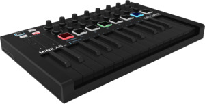
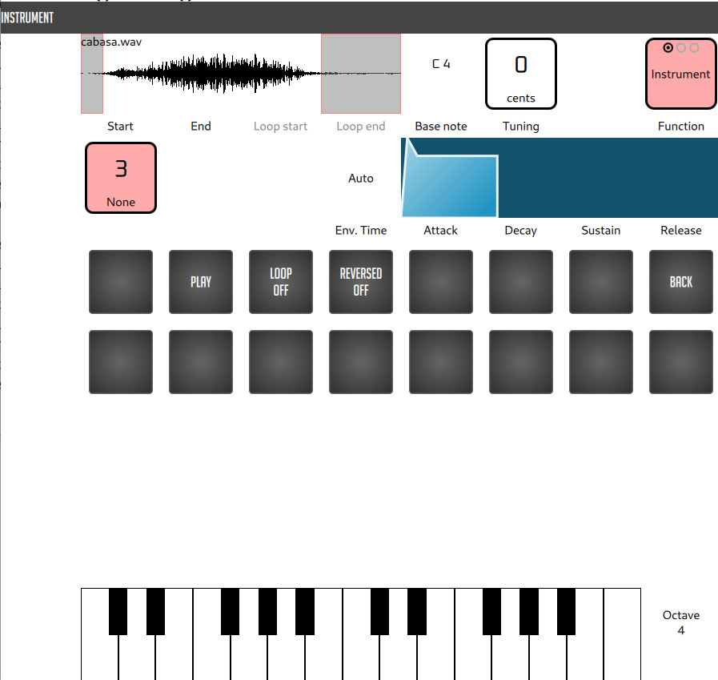
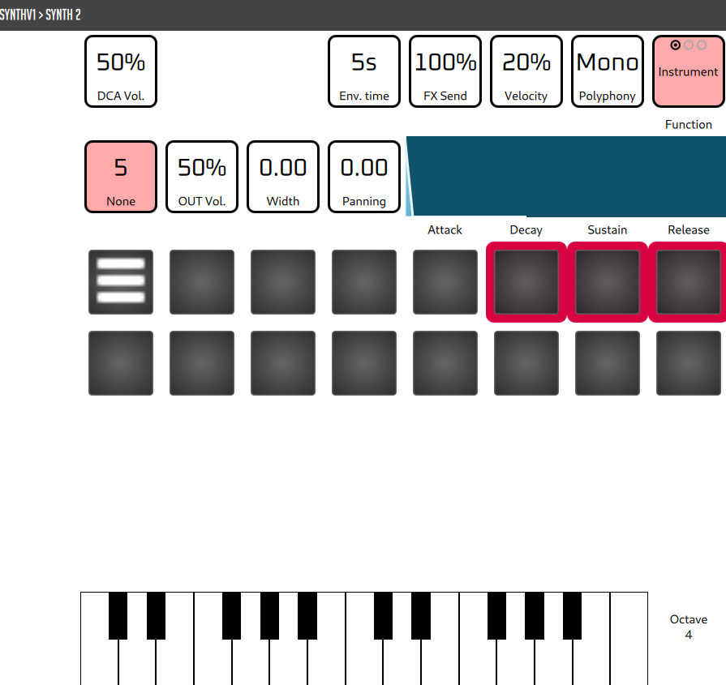
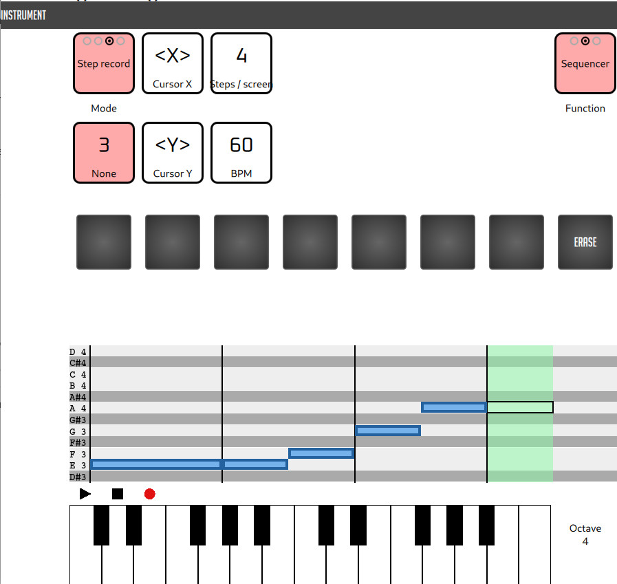
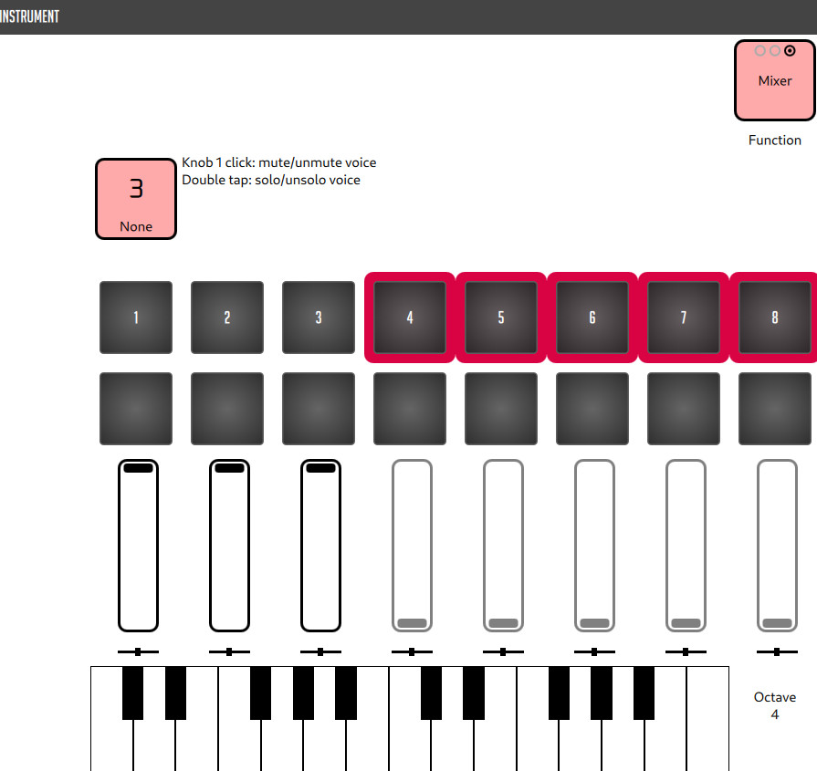

# NoisyQ, a MIDI controlled DAW

NoisyQ is a micro Digital Audio Workstation designed to be entirely controlled by a MIDI keyboard with a few knobs and pads.

Why one would want that ? Well, during my basic exploration of the computer-aided music production world, I found that there seems to exist two different schools of thoughts when it comes to music production: either software-based, through a DAW, or at the opposite, solely based on interconnected pieces of hardware, what some people call a "DAW-less" approach.
Some would probably say that the best setup is a mix between the two, e.g. hardware analog synthesizers with a software sequencer.

In my personal case, I find that lots of musical "edition" tasks are done very efficiently when hardware user interfaces are specialized. I am talking about the piano keyboard that is better suited than a computer keyboard to play notes (and chords, with varying velocity) and about knobs that generally have better ergonomics than a computer keyboard or a mouse to set the value of a "continuous" parameter.

That would make the "dawless" approach more appealing to me. But I find hardware boxes (samplers, synthesizers, grooveboxes, etc.) generally way too expensive or not flexible enough or too limited in features.

On the other side, I find DAWs (with VST) too complex and hard to play with, when it is required to jump between a computer keyboard, a mouse and an external controller.

So, I am exploring the idea of using a cheap generic MIDI keyboard to control entirely all functions of a small custom DAW. This way I try to have the best of both worlds: the good ergonomy of hardware boxes together with the flexibility of software.

Of course, I may in the end get something not that interesting: a hardware controller not that ergonomic for a very limited and clunky software user interface.

The probable real reason of why this project exists is to convince myself that I am on a path to "make music", while I am just procrastinating.

## Hardware

The project has been designed with the only MIDI controller I own: a [MiniLab mk II](https://www.arturia.com/products/hybrid-synths/minilab-mkii/overview).

I initially thought the project could be made generic enough so that it could be adapted to different MIDI controllers. After all, one can assume most of them share some piano keys, and something like 8 knobs and 8 pads. But designing for genericity is too premature.

It is also currently written on a PC running GNU/Linux, but could possibly be adapted to other platforms.

## Software

NoisyQ is currently written in Python, as a PyQt application with the following components:
- [Carla](https://github.com/falkTX/Carla/) an audio plugin host,
- a graphical user interface made with QtQuick (QML) composed of:
  - visual interfaces to audio plugins, e.g.: [synthv1](https://synthv1.sourceforge.io/), [samplv1](https://samplv1.sourceforge.io/) and generic soundfonts
  - a "piano roll" sequencer
- a sequencer (written in PyQt for now)
- some specialized Qt Widgets when QML is not enough:
  - a piano roll display
- a few external dependencies (in addition to Python + PyQt !):
  - ffmpeg to generate the "picture" of a sound sample in the samplv1 skin

  
## Status

The project is currently in development and is not ready for production.

## License

Unless stated differently, terms of the [General Public License v3](https://www.gnu.org/licenses/gpl-3.0.html) (GPL) apply.

## Screenshots

